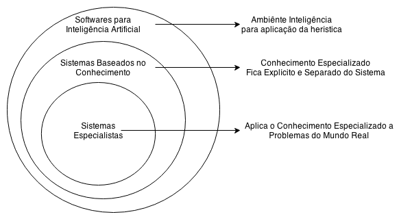
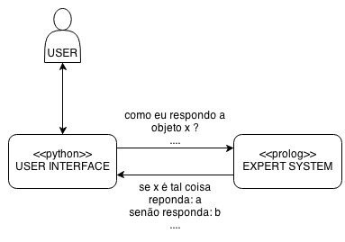

__Estudante__: Lucas Pagotto Tonussi

__Disciplina__: Paradigmas da Programção INE5416-04208 (20132)

__Professor__: Ricardo Azambuja Silveira

# Definição de sistema especialista (SE)

Um sistema especialista é um sistema computacional com uma estratégia de resolução de problemas.



# Linguagens Pesquisadas

Seguem as linguagens que pesquisamos para interface com o usuário. Todas são ótimas e trabalham bem a abordagem de se fazer ponte entre uma base de conhecimentos em Prolog.

## Perl

[Linguagem Perl](http://en.wikipedia.org/wiki/Perl)

* functional
* imperative
* object-oriented (class-based)
* reflective
* procedural
* data-driven
* generic

## Ruby

[Linguagem Ruby](http://en.wikipedia.org/wiki/Ruby_%28programming_language%29)

* object-oriented
* imperative
* functional
* reflective

## C

[Linguagem C](http://en.wikipedia.org/wiki/C_%28programming_language%29)

* Imperative (procedural)
* Structured

## Python

[Linguagem Python](http://en.wikipedia.org/wiki/Python_%28programming_language%29)

A linguagem escolhida é Python e estou usando [pyswip](http://code.google.com/p/pyswip).

* object-oriented
* imperative
* functional
* procedural
* reflective

## Java

[Linguagem Java](http://en.wikipedia.org/wiki/Java_%28programming_language%29)

* object-oriented
* structured
* imperative
* generic
* reflective

## C++

[Linguagem C++](http://en.wikipedia.org/wiki/C++_%28programming_language%29)

* procedural
* functional
* object-oriented
* generic


# Arquitetura (Software architecture)

Base de Conhecimentos

É basicamente uma série de regras e calculos que serão feitas em prolog para resolver problemas que são encontrados por sistemas mais sofísticados mas que não tem tanta firmeza de decisão. E prolog é considerado uma línguagem forte para decisões. Por isso ela é usada para sistemas especialistas e bastante interfaceada para varias linguagens de programação.

```
IF   | <algo acontecer> ; Antecendente
THEN | <faça isso>      ; Consequência
```

As regras precisam associar a evidência sobre o problema. Sob considerações a fim de o sistema especialista tirar conclusões para a linguagem de mais alto nível. Exemplos:

Verifica se o valor da temperatura está regulado corretamente.

```prolog
cota(CotaSuperior, CotaInferior, X, Result) :-
        X > CotaSuperior,
        Result is CotaSuperior, !.
cota(CotaSuperior, CotaInferior, X, Result) :-
        X < CotaInferior,
        Result is CotaInferior, !.
cota(CotaSuperior, CotaInferior, X, Result) :-
        X =< CotaSuperior,
        X >= CotaInferior,
        Result is X, !.
```

Se a temperatura média e a de fóra estão abaixo da cota superior a elas que é definida logo no começo
seta a temperatura para alguma temperatura cujo rendimento é válido para as preferencias dos hospedes.

```prolog
setto(TemperaturaExterior,
      TemperaturaMedia,
      CotaSuperior,
      CotaInferior,
      Ajuste,
      Rendimento,
      Write) :-

      TemperaturaMedia > CotaSuperior,
      TemperaturaExterior > CotaSuperior,

      cota(CotaSuperior,
           CotaInferior,
           TemperaturaMedia,
           Rendimento),

      append("Sistem (Erro): Temperatura exterior muito alta.",
             "MuitoQuenteException",
             Write), !.

Ou forma o rendimento ficar entre as cotas superiores ou inferiores.

```prolog
setto(TemperaturaExterior,
      TemperaturaMedia,
      CotaSuperior,
      CotaInferior,
      Ajuste,
      Rendimento,
      Write) :-

      TemperaturaMedia < CotaInferior,
      TemperaturaExterior < CotaInferior,

cota(CotaSuperior,
     CotaInferior,
     TemperaturaMedia,
     Rendimento),

append("Sistema (Erro): Temperatura exterior muito baixa.",
       "MuitoFrioException",
       Write), !.
```

Caso contrario procura por um bom rendimento

```prolog
setto(TemperaturaExterior,
      TemperaturaMedia,
      CotaSuperior,
      CotaInferior,
      Ajuste,
      Rendimento,
      Write) :-

ajuste(TemperaturaExterior,
       TemperaturaMedia,
       Ajuste,
       Unbounded),

cota(CotaSuperior,
     CotaInferior,
     Unbounded,
     Rendimento),
     \+ Unbounded == Rendimento,

append("Sistem (Erro): Ajuste fora dos limites.",
       "", Write), !.

setto(TemperaturaExterior,
      TemperaturaMedia,
      CotaSuperior,
      CotaInferior,
      Ajuste,
      Rendimento,
      Write) :-

ajuste(TemperaturaExterior,
       TemperaturaMedia,
       Ajuste,
       Unbounded),

cota(CotaSuperior,
     CotaInferior,
     Unbounded,
     Rendimento),

append("Sistem (Decidido): Temperatura ajustada.",
       "",
       Write), !.
```

Aqui seria o motor de decisão (na verdade onde se faz os calculos para a tomada de decisao 'setto'), onde ele decide ajustar ou não dependendo dos valores problema passados pelo programinha em Python.

```prolog
ajuste(TemperaturaExterior, TemperaturaMedia, Ajuste, Rendimento) :-
        \+ TemperaturaMedia == TemperaturaExterior,
        TemperaturaExterior > TemperaturaMedia,
        abs(TemperaturaExterior-TemperaturaMedia, TaxaVariacao),
        abs(TemperaturaExterior - (TaxaVariacao * (1 - (Ajuste / 100))), Rendimento).

ajuste(TemperaturaExterior, TemperaturaMedia, Ajuste, Rendimento) :-
        \+ TemperaturaMedia == TemperaturaExterior,
        TemperaturaExterior < TemperaturaMedia,
        abs(TemperaturaExterior-TemperaturaMedia, TaxaVariacao),
        abs(TemperaturaExterior + (TaxaVariacao * (1 - (Ajuste / 100))), Rendimento).

ajuste(TemperaturaExterior, TemperaturaExterior, Ajuste, Rendimento) :-
        TemperaturaMedia == TemperaturaExterior,
        Rendimento is TemperaturaExterior.
```

A máquina de inferências é um programa de computador desenhado para produzir um dicernimento sobre regras. Existem muitos tipos de abordagens lógicas, via lógica proposicional, predicados de ordem >= 1, lógica epistêmica, lógica modal, lógica temporal, lógica fuzzy, lógica probabilistica (implementada por Redes de Bayesianas), dentre outras. A proposicional é mais usada, por ser natural nos seres humanos, e é expressada com silogismos. O sistema especialista que usa tal lógica é também chamado de ordem zero-ésima. Com lógica, o programa é capaz de gerar novas informações vindas do conhecimento na base de regras e informações.

- __Base de Conhecimento__: Regras IF-THEN-ELSE + Matemática.
- __Base de Dados__: Dados específicos para o problema.
- __Mecânismo de Inferência__: O núcleo pensante.
- __Interface de Usuário__: Faz o diálogo.


Dentro do diretório bindings existe um simples software em python, que trata a temperatura de um quarto de hotel (prédio, casa) imaginando que existem sensores espalhados e o controlador desse sistema consegue ler as informações dos sensores e jogar no computador (software) para que ele resolva, na verdade, ajude a resolver. É um problema simples. Mas do jeito que está construído basta reusar e adicionar mais sensores (mais variaveis problematicas). Aí no caso de mais adicões é preciso ir em intel.pro e adicionar mais calculos para sensores diferentes. Quando o operador por exemplo alguem responsável no hotel cadastra hóspedes eles dizem a temperatura que eles gostariam que fosse o quarto de hóspedes dele. A cadastrante aciona o software e preenche a temperatura que está sendo lida pelos sensores em graus celcius, e depois preenche o ajuste, o ajuste é o quanto pode variar a temperatura em relação a temperatura externa e interna do quarto (pode ser quarto, recipiente, qualquer coisa, depende do contexto). Conforme hospedes são adicionados intel.pro vai sendo requisitado para que seja resolvido por ele o problema da temperatura externa, e interna, porém a interna é baseado numa média das temperaturas que os hóspedes pediram. É bastante simples.


Para usar o software, você precisa:

  - Python 2.7.2+
  - PySWIP 0.2.2+
  - Prolog (Swipl) 5+

```bash
python bindings/main.py
```

Aos Dependentes de Windows:

- Copia e cola swipl.dll e renomeia a duplicata para libpl.dll
- Adiciona \\pl\\bin ao PATH das configurações Windows.



# Referências

[Expert System at Wiki](https://en.wikipedia.org/wiki/Expert_system)

[Language Binding at Wiki](http://en.wikipedia.org/wiki/Language_binding)

[Sistemas Especialistas](http://www.dee.ufma.br/~lpaucar/teaching/ia2000-1/cap4.html)

[IRQ Expert System](http://www.amzi.com/articles/irq_expert_system.htm)

[Building Expert Systems in Prolog](http://www.amzi.com/ExpertSystemsInProlog/index.htm)

[Interfacing Arduino Python](http://playground.arduino.cc/Interfacing/Python)

[Python Unit Test Framework](http://pyunit.sourceforge.net/pyunit.html)
